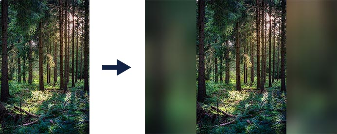

# Image Resize with Blur Effect

Resizes an image so it fits within the specified size, centered horizontally and vertically. The image is _not_ cropped or stretched, only scaled.

If the aspect ratio of the output image is different than the input, then the 'blank' areas are filled in with a blurred version of the original image.

## Example 1

## Example 2

